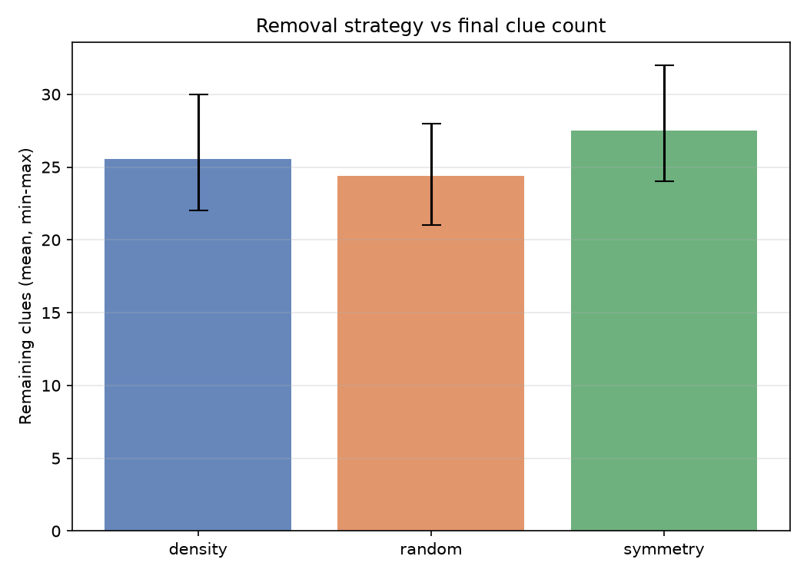
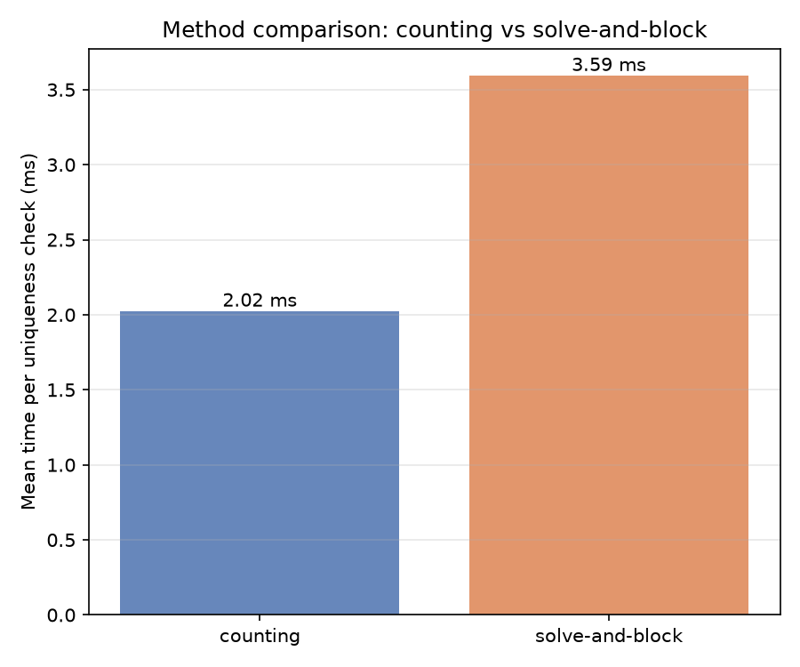
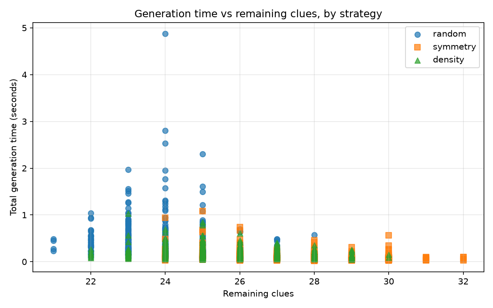
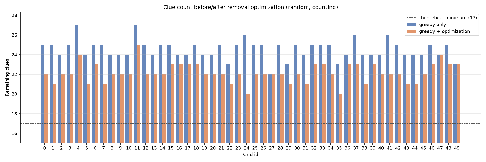

<style>
@page { size: A4; margin: 1.5cm 1.7cm; }
html { font-size: 100%; }
body { font-family: "Helvetica Neue", Arial, sans-serif; font-size: 11.5px; line-height: 1.4; max-width: none; color: #1a1a1a; }
h1 { font-size: 21px; margin: 0 0 4px; }
h2 { font-size: 15px; margin: 13px 0 5px; border-bottom: 1px solid #ccc; padding-bottom: 2px; }
h3 { font-size: 12.8px; margin: 10px 0 3px; }
p, li { margin: 3px 0; }
pre { font-size: 9.6px; line-height: 1.3; background: #f5f5f5; padding: 5px 7px; border-radius: 3px; overflow: hidden; }
code { font-size: 9.8px; background: #f0f0f0; padding: 0 2px; border-radius: 2px; }
pre code { background: none; padding: 0; }
table { border-collapse: collapse; font-size: 10.6px; margin: 4px 0; }
th, td { border: 1px solid #bbb; padding: 2px 6px; }
img { max-width: 86%; display: block; margin: 4px auto; }
</style>

# Sudoku Instance Generation With Uniqueness Guarantee

**Course**: Constraint Programming (a.y. 2025-2026), University of Parma\
**Students**: Martin Trajkovski, Leopoldo Antozzi\
**Project**: 19 - Sudoku Instance Generation

---

## 1. Introduction

The goal of this project is the automatic generation of 9×9 Sudoku instances that are admissible, uniquely solvable, and with the smallest possible number of clues. While a Sudoku *solver* is the classic textbook application of Constraint Programming, *generation* adds a further layer: it requires a mechanism that, given a partially filled puzzle, decides whether it admits exactly one solution. This **uniqueness** check is not expressed directly by the constraints of the problem, it is built *on top of* the base CSP model.

The project is organised into three components:

1. A MiniZinc model for the Sudoku decision problem, which serves as the core for both solving and validation;
2. A uniqueness-checking mechanism, implemented in two variants (solve-and-block and solution counting) so that they can be compared;
3. A Python-orchestrated pipeline that applies iterative clue-removal strategies to produce minimal instances.

The problem is particularly relevant for the course because it explicitly exercises the `alldifferent` propagator, search heuristics, the effect of redundant constraints, and it highlights the conceptual gap between *solving* and *generating* in CP: solving is a CSP, whereas generation is a search procedure that uses the CSP as a subroutine.

## 2. Modelling Sudoku

Sudoku is modelled as a CSP with 81 integer variables over the domain `1..9`:

```minizinc
int: n = 9;
set of int: IDX = 1..n;
array[IDX, IDX] of 0..9: clues;
array[IDX, IDX] of var 1..9: grid;

constraint
  forall(i in IDX, j in IDX where clues[i, j] > 0) (
    grid[i, j] = clues[i, j]
  );

constraint forall(i in IDX) (alldifferent([grid[i, j] | j in IDX]));
constraint forall(j in IDX) (alldifferent([grid[i, j] | i in IDX]));
constraint forall(br, bc in 0..2) (
  alldifferent([grid[3*br+dr, 3*bc+dc] | dr in 1..3, dc in 1..3])
);
```

The **clues** are passed as a parameter `array[IDX, IDX] of 0..9`: the value `0` denotes a free cell, while values `1..9` pin a cell through the equality constraint. The constrained parameter domain `0..9` also acts as input validation: MiniZinc rejects out-of-range data at load time. This design lets partial puzzles be fed to the solver without modifying the model itself.

The three `alldifferent` families (rows, columns, 3×3 blocks) are the classic constraints, 27 constraints in total, each over 9 variables. Choosing the global constraint instead of a decomposition into pairwise inequalities (`grid[i,a] != grid[i,b]`) has a concrete propagation impact. As seen in class, the `alldifferent` propagator is enforced through filtering based on **maximum matching in a bipartite graph** (variables on one side, values on the other), following Régin (1994): a value with no matching edge is pruned, and Berge's theorem on alternating paths identifies the edges that cannot belong to any maximum matching. This achieves **arc consistency (AC)** in polynomial time, whereas the disjunctive formulation only achieves **bounds consistency (BC)** and fails to detect many infeasible states early (e.g. three cells sharing the domain `{1,2}` is a contradiction that AC catches immediately but pairwise `!=` does not).

### 2.1 Search annotation

The annotation `int_search([grid[i,j] | i in IDX, j in IDX], first_fail, indomain_min, complete)` follows a classic choice. `first_fail` selects the variable with the smallest current domain: this is the **fail-first principle** (Haralick & Elliott, 1980): branching on the most constrained cell makes failures happen high in the search tree, where pruning is cheapest. This fits Sudoku well, where domain sizes are very heterogeneous after the clues are propagated. `indomain_min` picks the smallest value (a conservative default), and `complete` performs an exhaustive depth-first search with backtracking, the only mode able to *prove* unsatisfiability or uniqueness since it must exhaust the tree.

The variant `models/sudoku_solver_dom_w_deg.mzn` uses `dom_w_deg` (domain over weighted degree) as variable selection. Each constraint carries a weight, incremented every time it causes a domain wipe-out; a variable's score is `|domain(x)| / weighted_degree(x)`, and the lowest score is chosen. It is an *adaptive* fail-first: besides domain size, it accounts for how often a variable is involved in failing constraints, so the search learns from past conflicts (Boussemart et al., 2004). On strongly constrained instances (a nearly full Sudoku) the difference is marginal, but on more open puzzles or on larger boards, it can reduce backtracks.

### 2.2 Redundant constraints

The variant `models/sudoku_solver_redundant.mzn` adds `sum = 45` constraints on rows, columns and blocks:

```minizinc
constraint forall(i in IDX) (sum([grid[i, j] | j in IDX]) = 45);
```

These constraints are *implied* by the `alldifferent` (the nine digits `1..9` always sum to 45): they add and remove no solutions, so the solution set is identical. What changes is **propagation**. The sum is a linear constraint giving immediate bound reasoning (if eight cells are fixed, the ninth is derived directly by difference), with a different algebraic semantics from `alldifferent`. On 9×9 Sudoku, where `alldifferent` is already strong, the measured gain is limited and the value of the variant is mainly pedagogical: redundant constraints help when their propagator reasons over a structure different from the one already propagated.

### 2.3 Full-grid generation

The model `models/sudoku_generate_full_grid.mzn` reuses the same structure but replaces `indomain_min` with `indomain_random`, so that repeated runs with different seeds produce different complete grids (with `indomain_min` the solver always returns the lexicographically minimal solution). In this project the model is kept as a **fallback** and as an autonomous check of the structural correctness of complete grids. For the main experiments, instead, complete solutions are drawn from the **Kaggle Sudoku Dataset** (`rohanrao/sudoku`) via a dedicated import script that uses reservoir sampling (Vitter's algorithm R) to sample uniformly from the 9M-row file in constant memory: a 50-grid sample (`data/solved/sample_solutions.json`) used for quick demos and the post-optimization experiment, and a 500-grid sample (`data/solved/sample_solutions_500.json`) used for the main benchmark.

## 3. Uniqueness Checking

The "exactly one solution" requirement cannot be expressed as a single CP constraint: it requires reasoning about the *number* of solutions, not about satisfiability. This is worth framing in terms of complexity. The Sudoku decision problem (does a solution exist?) is **NP-complete** for the generalised `n²×n²` board (Yato & Seta, 2003). *Counting* all solutions is **#P-complete** - strictly harder. However, uniqueness only needs to know whether there are *at least two* solutions: the problem `#≥2` is in **NP**, since two distinct solutions are a polynomial-size certificate. Both methods below exploit this, they never count beyond two.

### 3.1 Solve-and-block

The workflow is:

1. solve the puzzle; if it has no solution → `unsat`;
2. store the found solution `S₁`;
3. search for a solution `S₂ ≠ S₁` (in MiniZinc, the model `models/sudoku_non_unique_check.mzn` adds the **blocking constraint** `exists(i,j) (grid[i,j] != known_solution[i,j])`);
4. if the second search is `unsat` → unique; otherwise → multiple.

Advantage: two complete, independent searches, naturally expressible in MiniZinc, and the blocking constraint propagates from the start of the second search. Disadvantage: the second search restarts from scratch. For a *unique* puzzle this second search is the worst case, it must exhaust the tree to prove no alternative exists (i.e. prove UNSAT).

### 3.2 Solution counting

The workflow is:

1. start the search, enumerating solutions;
2. stop as soon as two are found (limit `n=2`);
3. classify by count: 0 → `unsat`, 1 → unique, ≥2 → multiple.

In MiniZinc this uses the flag `-a -n 2`. In the Python backend it is implemented by continuing the backtracking after the first solution:

```python
def count_solutions_python(grid, limit=2):
    ...
    if cell is None:
        found += 1
        ...
        return
    for value in candidate_values(work, row, col):
        work[row][col] = value
        backtrack()
        work[row][col] = 0
        if found >= limit:
            return
```

The `limit=2` short-circuit is the key: it keeps the problem in NP rather than #P. Advantage: it avoids restarting and reuses the search state after the first solution. Disadvantage: for unique puzzles it still explores the whole tree to prove that the second solution does not exist.

### 3.3 Timeout handling

Each uniqueness check can yield three outcomes:

- ✅ `unique`: the second search terminates with UNSAT within the timeout;
- ❌ `multiple`: a second solution is found;
- ⚠️ `unknown`: the timeout fires with no verdict.

The `unknown` case is **never** silently treated as `unique`: the pipeline rolls back the last removal and logs the event, so its frequency can be quantified. This is essential for correctness - treating `unknown` as `unique` could accept a non-unique puzzle. In the counting backend the distinction is drawn from the output markers: a single solution followed by `==========` (search exhausted) means `unique`, whereas a single solution *without* exhaustion means `unknown` (the timeout interrupted the search for the second).

## 4. Puzzle Generation

### 4.1 Iterative scheme

Starting from a complete grid `G`, the algorithm proceeds as follows:

```
puzzle ← G
for each position (r, c) in the strategy's order:
    if puzzle[r,c] == 0: continue
    backup ← puzzle[r,c]
    puzzle[r,c] ← 0
    if uniqueness(puzzle) == unique:
        accept (the cell stays empty)
    else:
        puzzle[r,c] ← backup        # rollback
return puzzle
```

The invariant is that the puzzle remains uniquely solvable throughout. This is a **greedy scheme with rollback**: every cell is decided once and never reconsidered. It is therefore *not optimal.* Reaching the theoretical minimum would require backtracking on the removals. The final number of clues depends on the order in which positions are tested, which motivates comparing strategies.

### 4.2 Removal strategies

Three strategies are compared (`scripts/sudoku_pipeline.py`, function `iter_positions`):

- **Random**: a random permutation of the 81 cells (baseline).
- **Symmetry-aware**: removes the pair `(r, c)` and its central mirror `(8-r, 8-c)` together. It produces visually symmetric puzzles (in the style of newspaper Sudoku) but is more constrained: each rejection blocks two positions instead of one, a "double tax". It is worth stressing that this is a generation *heuristic for aesthetics*, not **symmetry breaking** in the CP sense. We are not removing symmetric branches from a search space, we are imposing a visual property on the output. The model itself does no symmetry breaking, since the clues already break the symmetries of the empty grid.
- **Density-aware**: orders cells from the periphery to the centre (decreasing Manhattan distance from the centre), under the hypothesis that corner cells have fewer incident constraints and are thus more "removable" without breaking uniqueness.

### 4.3 Data format

The data follow a minimal JSON format:

- complete grids: `{"grids": [9x9, …]}`
- input puzzle: `{"grid": 9x9}` with `0` for empty cells
- generated puzzles: an object with `puzzle`, `solution`, `clues`, `removal_log`, etc.

## 5. Pipeline Architecture

The project adopts a **hybrid** architecture: MiniZinc handles the CP queries (solving and uniqueness checking), while a Python script orchestrates the iterative clue removal and collects statistics.

```
┌───────────────────┐        ┌──────────────────────┐
│ Kaggle / generated│        │ Python orchestrator  │
│   solutions       │ ─────▶ │ - removal strategy   │
└───────────────────┘        │ - logging            │
                             └────────┬─────────────┘
                                      │ (puzzle + method)
                                      ▼
                             ┌──────────────────────┐
                             │ Uniqueness backend   │
                             │ - Python (in-process)│
                             │ - MiniZinc (Gecode)  │
                             └────────┬─────────────┘
                                      │ verdict
                                      ▼
                             ┌──────────────────────┐
                             │ Results:             │
                             │ - JSON puzzle        │
                             │ - CSV benchmark      │
                             │ - PNG plots          │
                             └──────────────────────┘
```

### 5.1 Python backend

The Python backend implements the solver, counting and solve-and-block in pure Python with backtracking and forward checking (`candidate_values` computes a cell's legal values = the `alldifferent` propagation on one cell; `find_empty` is a hand-written `first_fail`). It does not replace the course's CP backend; it serves to:

- validate the pipeline end-to-end even when MiniZinc is not installed;
- provide a fast execution for the experimental benchmark (MiniZinc's per-call overhead is ~200 ms, non-negligible across 80+ checks per puzzle).

### 5.2 MiniZinc backend

The MiniZinc backend invokes `minizinc --solver gecode_local.msc <model> <data.dzn>` as a subprocess, parses the output and handles timeouts. The configuration `spec/gecode_local.msc` points to the `fzn-gecode` binary via `PATH` for portability. It supports both uniqueness methods via dispatch:

- `solve-and-block` runs two distinct calls: first `sudoku_solver.mzn`, then `sudoku_non_unique_check.mzn` with the first solution passed as the `known_solution` parameter;
- `counting` runs a single call to `sudoku_solver.mzn` with the flags `-a -n 2`. The output is parsed to count how many distinct solutions were emitted (separated by `----------`). The marker `==========` indicates the search was exhausted; otherwise a single solution without exhaustion becomes `unknown` (timeout) and triggers a rollback in the generation pipeline.

A third backend, `minizinc-api`, drives the same models through the MiniZinc-Python library instead of manual subprocess management; it was added to test the start-up-cost hypothesis and is evaluated in Section 7.2.

## 6. Experiments

### 6.1 Setup

- **Benchmark**: 500 complete grids sampled from the 9M-row Kaggle Sudoku Dataset × 3 strategies × 2 uniqueness methods = **3000 runs** (~10 minutes with the Python backend). At this sample size the standard error of the mean clue count is below 0.05, so a larger sample would not change the reported figures; a control benchmark on 1000 grids (`results/full_benchmark_1000.csv`) confirms it, with every reported mean shifting by less than 0.12.
- **Backend**: Python (for the reported timings). MiniZinc is functionally verified, but the number of calls (240,000+ for the full benchmark) makes it slow for the prototype.
- **Timeout**: no timeout on the Python backend (9×9 puzzles are always solved in ms). The 5-minute timeout is applied in MiniZinc mode.
- **Seed**: 42 (reproducible); each grid derives its own seed deterministically from the master seed.

The starting complete grids come from a public dataset. Internal full-grid generation remains available for targeted tests, autonomous reproducibility and validation independent of the external dataset.

### 6.2 Results: minimum clues per strategy

| Strategy | Mean | Min | Max | Stdev |
| -------- | ---- | --- | --- | ----- |
| Random   | 24.4 | 21  | 28  | 1.12  |
| Symmetry | 27.5 | 24  | 32  | 1.53  |
| Density  | 25.5 | 22  | 30  | 1.32  |

**Observation**: the *random* strategy yields the lowest average clue count (24.4), confirming that flexibility in the removal order pays off. *Symmetry* is the most constrained (27.5) because it removes pairs and every rejection blocks two positions instead of one. *Density* sits in between, suggesting that the "corner cells first" heuristic is not substantially different from random: the structure of Sudoku makes all cells roughly equally constrained, so the starting hypothesis does not hold.

The absolute minimum reached by the greedy scheme is **21 clues**, hit only once in 1500 random-strategy runs; the typical best is 22–23, well above the known theoretical minimum of 17 (McGuire et al., 2012) and consistent with a greedy scheme without backtracking on the removal. Section 7.1 shows how a post-optimization pass pushes below this, reaching 21 systematically rather than by luck and a best of **20 clues**.



<div style="page-break-before: always;"></div>

### 6.3 Results: counting vs solve-and-block

| Method          | Mean time per check | Median |
| --------------- | ------------------- | ------ |
| Counting        | 2.0 ms              | 1.5 ms |
| Solve-and-block | 3.6 ms              | 2.6 ms |

**Observation**: counting is ~1.8× faster on average. This is consistent with the structure: counting reuses the search state after the first solution, while solve-and-block performs two disjoint searches (the second with an added constraint). For unique instances, solve-and-block must prove UNSAT from scratch, whereas counting has already explored part of the tree.

Importantly, the two methods are **equivalent** in terms of the final clue count (the accept/reject decision is the same, because both correctly distinguish unique/multiple). The choice is purely one of efficiency.



### 6.4 Time vs remaining clues

The image shows a mild correlation: puzzles with fewer clues tend to require more time, but the variance is high. This reflects that the main cost per run is the `~80` uniqueness checks, each costing ~1.5–4 ms: the number of checks is constant (81, one per cell), so the total time measures the average difficulty of the intermediate puzzles, which is only weakly correlated with the final clue count.



### 6.5 Redundant constraints and search annotations

The variants `sudoku_solver_redundant.mzn` and `sudoku_solver_dom_w_deg.mzn` were prepared for a pure-MiniZinc comparison. On 9×9 the measured gains are marginal (below the statistical variance), because the `alldifferent` propagator is already strong enough. On larger boards (16×16, 25×25) a more visible effect is expected.

### 6.6 Validation on known 17-clue puzzles

To check the uniqueness verifier at the hardest possible point, it was run on five genuine **17-clue** puzzles (the proven theoretical minimum) drawn from Gordon Royle's catalogue (`data/test/royle_17clue_sample.json`). All five are correctly classified as **unique** by *both* methods (counting and solve-and-block) and by *both* backends (Python and MiniZinc/Gecode), with no false positives. The cost, however, jumps from the ~2 ms of an intermediate generation check to **0.8–8.6 s** per puzzle: with only 17 clues the search tree that must be exhausted to prove no second solution exists is enormous. This both validates the checker on minimal instances and gives a concrete feel for why the 20→17 gap is computationally hard, not merely a matter of a better removal heuristic.

## 7. Implemented Extensions

Three of the extensions listed in the first version of this report were subsequently implemented and measured.

### 7.1 Backtracking on the removal

The greedy scheme of Section 4.1 is order-dependent and stops at a local minimum. The flag `--optimize-attempts N` adds a post-optimization pass based on an *add-one-remove-many* move: a removed cell is re-filled with its solution value (uniqueness is preserved by construction, adding a clue can never create a second solution), then a fresh greedy removal pass runs over all current clues in a new random order. If the pass removes at least two cells the net clue count decreases and the move is kept; otherwise it is rolled back. This is a simple local search on top of the CP check, escaping the plateau the greedy pass got stuck in.

Measured on the 50-grid sample (random strategy, counting, 100 attempts, ~2400 extra checks ≈ 30 s per grid with the Python backend): **47 of 50 runs improved**, the mean drops from 24.5 to **22.1** clues and the minimum reaches **20** — a bound the plain greedy hit zero times across 1500 benchmark runs, while the optimization reaches ≤21 on 11 of 50 grids. The pass turns the lucky tail of the greedy distribution into a systematic outcome.

| Configuration | Mean | Min | Max |
| ------------- | ---- | --- | --- |
| Greedy only | 24.5 | 22 | 27 |
| Greedy + optimization | 22.1 | 20 | 25 |

The returns diminish sharply: on a sample grid, 20 attempts reach 21 clues and 1000 attempts (50× the checks) still stop at 21. The local move plateaus quickly, which is consistent with two facts: the minimum clue count is a property of each complete grid (most grids do not even admit a 17-clue puzzle), and reaching 19 or fewer requires coordinated multi-cell reconfigurations outside the reach of a single add-one-remove-many move. Enlarging the neighbourhood does help — Section 7.4 lowers the mean with a variable-neighbourhood variant — but, as shown there, even a branch-and-bound search does not push the minimum below 20 within a practical budget.



### 7.2 MiniZinc-Python backend: a negative result

The hypothesis was that the MiniZinc-Python API would cut the subprocess start-up cost. The backend `minizinc-api` drives the same two models through the library (the blocking constraint of solve-and-block is injected with `instance.branch()` + `add_string`). On identical generation runs it produces exactly the same puzzles, but it is *slower*:

| Backend | Time per check |
| ------- | -------------- |
| `minizinc` (subprocess) | ~0.20 s |
| `minizinc-api` | ~0.36 s |

The reason is that MiniZinc-Python **wraps the CLI rather than embedding the compiler**: flattening and process creation still happen on every solve, with the library's asyncio management added on top. The dominant per-check cost is the flattening, not the Python-side subprocess handling, so the start-up-cost hypothesis targeted the wrong component. The practical fix would be a persistent solver process or direct Gecode bindings. Raw data: `results/minizinc_api_comparison.json`.

### 7.3 Symmetries: complete grids without the external dataset

The `augment` subcommand generates new complete grids by composing validity-preserving transformations of existing ones: digit permutation, permutation of rows within a band, permutation of bands, and transposition (which covers the column-side operations). Each output grid is re-validated against the Sudoku constraints. From the 50 Kaggle solutions, 20 transformed grids were generated (`data/solved/augmented_solutions.json`): all valid, none coinciding with a source grid, and directly usable as `--source` for the generation pipeline.

Together with `sudoku_generate_full_grid.mzn`, this makes the pipeline fully self-contained: the external dataset remains preferable for *statistical* purposes (transformed grids are structurally related to their source, not independent samples), but it is no longer a functional dependency.

### 7.4 Stronger search: variable neighbourhood and branch-and-bound

The local search of Section 7.1 re-adds a single clue per perturbation. Two stronger strategies were implemented to test whether more search effort lowers the clue count further:

- **Variable-neighbourhood** (`--optimize-readd k`): each perturbation re-adds up to `k` clues, with `k` growing from 1 towards `k` as attempts stall (diversification) and resetting after every improvement (intensification).
- **Branch-and-bound** (`--bnb-nodes N`): a node-bounded search over the binary keep/remove decision per cell, warm-started from the local-search incumbent. The "remove" branch is taken only while the puzzle stays unique with all undecided cells present (a sound prune by monotonicity), and the bound `kept ≥ best` cuts branches that can no longer improve. The full tree is exponential — the minimum-clue subset space is of order `C(81, ~22)` — so the search is capped at `N` nodes and restarted from reshuffled orders.

Comparison on **408 grids sampled fresh from the 9M-row Kaggle dataset** (random strategy, counting, 100 attempts, `k=3`, `N=8000`):

| Optimiser | Mean | Min | Max | Stdev | Time/grid |
| --------- | ---- | --- | --- | ----- | --------- |
| greedy (baseline) | 24.41 | 21 | 28 | 1.16 | – |
| local search, re-add 1 | 22.08 | 20 | 24 | 0.81 | 49 s |
| variable-neighbourhood, re-add ≤3 | 21.54 | **20** | 24 | 0.68 | 51 s |
| branch-and-bound (8k nodes) | 21.51 | 20 | 23 | 0.66 | 92 s |

**Findings**. The variable neighbourhood is a genuine improvement over the single-cell local search: it lowers the mean from 22.08 to 21.54 and wins on **192 of 408** grids while losing on only 37, at almost no extra cost (51 vs 49 s). Branch-and-bound, by contrast, does **not** pay off: it ties the variable neighbourhood on 396 of 408 grids and beats it on just 12, while costing nearly twice the time (92 s). Within any practical node budget the warm-started DFS explores only a sliver of the astronomically large subset space, so it cannot systematically outperform a good metaheuristic. This reinforces the recurring lesson of Section 7.2: the residual gap to 17 is governed by the grid-determined minimum, and closing it would require an exact combinatorial method (unavoidable-set / hitting-set formulations, as in McGuire et al.), not more generic search.

The clue-count **distribution** over the 408 grids confirms how concentrated the achievable minimum is — the variable neighbourhood lands at 20–22 clues on 98% of grids:

| Clues reached | 20 | 21 | 22 | 23 | 24 |
| ------------- | -- | -- | -- | -- | -- |
| greedy | – | 2 | 14 | 69 | 139¹ |
| variable-neighbourhood | 18 | 176 | 191 | 22 | 1 |

¹ greedy also spreads up to 28 clues; only the 20–24 range is shown. Raw data: `results/overnight_comparison.csv` (408 grids) and `results/optimizer_comparison.csv` (the earlier 20-grid run).

## 8. Conclusions

The project delivers a complete pipeline for generating Sudoku instances with a uniqueness guarantee, showing how the combination of clean CP modelling and external orchestration suits a "meta" problem that repeatedly queries the solver.

**Main results**:

- the *random* strategy is the most effective in terms of minimum clues (24.4 average); the local-search pass of Section 7.1 lowers the mean by a further ~2.4 clues, and the variable-neighbourhood variant of Section 7.4 reaches a best of **20** clues (over 408 grids);
- the *counting* method is ~1.8× faster than *solve-and-block* in high-call-frequency scenarios;
- separating the removal logic (procedural) from the verification (CP) is key for debugging and analysis;
- explicit handling of the `unknown` timeout case is critical for the correctness of the output;
- the MiniZinc-Python experiment (Section 7.2) shows the value of *measuring* a proposed optimisation: the library wraps the CLI, so the expected speed-up does not materialise.

**Limitations**:

- even with the variable-neighbourhood search, the minimum clue count reached (20) is still above the theoretical limit of 17, and branch-and-bound did not improve on it (Section 7.4); closing the gap would require an exact unavoidable-set method, not more generic search;
- the augmented grids of Section 7.3 are structurally related to their source grid, so they are not independent samples for statistical purposes;
- the MiniZinc backend remains operationally slow for intensive benchmarks; the real fix is a persistent solver process or direct Gecode bindings, not the MiniZinc-Python wrapper.

**Possible extensions**:

- extend the benchmark to an even larger sample of the full Kaggle Sudoku Dataset (9M instances) to better generalise the statistics;
- implement a "difficulty" metric (e.g. how often guessing is needed vs pure propagation) and search for puzzles with a target difficulty;
- parameterise the models over the block size to study 16×16 and 25×25 boards, where the gap between the global `alldifferent` and its decomposition is expected to widen.

---

## References

- K. Apt. *Principles of Constraint Programming*. Cambridge University Press, 2003.
- J.-C. Régin. *A filtering algorithm for constraints of difference in CSPs*. AAAI, 1994.
- C. Berge. *Graphs and Hypergraphs*. North-Holland, 1973 (theorem on augmenting paths).
- R. Haralick, G. Elliott. *Increasing tree search efficiency for constraint satisfaction problems*. Artificial Intelligence, 1980.
- F. Boussemart, F. Hemery, C. Lecoutre, L. Sais. *Boosting systematic search by weighting constraints*. ECAI, 2004.
- T. Yato, T. Seta. *Complexity and completeness of finding another solution and its application to puzzles*. IEICE Transactions, 2003.
- G. McGuire, B. Tugemann, G. Civario. *There is no 16-clue Sudoku: solving the Sudoku minimum number of clues problem*. arXiv:1201.0749, 2012.
- MiniZinc Tutorial: https://www.minizinc.org/doc-2.7.6/en/index.html
- Kaggle Sudoku Dataset: https://www.kaggle.com/datasets/rohanrao/sudoku
