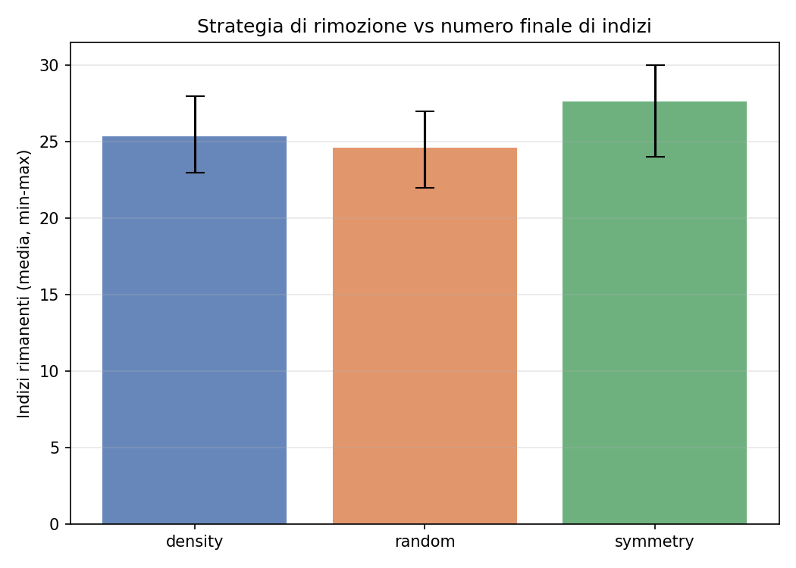

# Sudoku Instance Generation With Uniqueness Guarantee

**Course**: Constraint Programming (a.y. 2025-2026), University of Parma
**Students**: Martin Trajkovski, Leopoldo Antozzi
**Project**: 19 - Sudoku Instance Generation

---

## 1. Introduction

The goal of this project is the automatic generation of 9×9 Sudoku instances that are admissible, uniquely solvable, and with the smallest possible number of clues. While a Sudoku *solver* is the classic textbook application of Constraint Programming, *generation* adds a further layer: it requires a mechanism that, given a partially filled puzzle, decides whether it admits exactly one solution. This **uniqueness** check is not expressed directly by the constraints of the problem - it is built *on top of* the base CSP model.

The project is organised into three components:

1. A MiniZinc model for the Sudoku decision problem, which serves as the core for both solving and validation;
2. A uniqueness-checking mechanism, implemented in two variants (solve-and-block and solution counting) so that they can be compared;
3. A Python-orchestrated pipeline that applies iterative clue-removal strategies to produce minimal instances.

The problem is particularly relevant for the course because it explicitly exercises the `alldifferent` propagator, search heuristics, the effect of redundant constraints, and it highlights the conceptual gap between *solving* and *generating* in CP: solving is a CSP, whereas generation is a search procedure that uses the CSP as a subroutine.

## 2. Modelling Sudoku

Sudoku is modelled as a CSP with 81 integer variables over the domain `1..9`:

```minizinc
int: n = 9;
set of int: IDX = 1..n;
array[IDX, IDX] of 0..9: clues;
array[IDX, IDX] of var 1..9: grid;

constraint
  forall(i in IDX, j in IDX where clues[i, j] > 0) (
    grid[i, j] = clues[i, j]
  );

constraint forall(i in IDX) (alldifferent([grid[i, j] | j in IDX]));
constraint forall(j in IDX) (alldifferent([grid[i, j] | i in IDX]));
constraint forall(br, bc in 0..2) (
  alldifferent([grid[3*br+dr, 3*bc+dc] | dr in 1..3, dc in 1..3])
);
```

The **clues** are passed as a parameter `array[IDX, IDX] of 0..9`: the value `0` denotes a free cell, while values `1..9` pin a cell through the equality constraint. The constrained parameter domain `0..9` also acts as input validation - MiniZinc rejects out-of-range data at load time. This design lets partial puzzles be fed to the solver without modifying the model itself.

The three `alldifferent` families (rows, columns, 3×3 blocks) are the classic constraints - 27 constraints in total, each over 9 variables. Choosing the global constraint instead of a decomposition into pairwise inequalities (`grid[i,a] != grid[i,b]`) has a concrete propagation impact. As seen in class, the `alldifferent` propagator is enforced through filtering based on **maximum matching in a bipartite graph** (variables on one side, values on the other), following Régin (1994): a value with no matching edge is pruned, and Berge's theorem on alternating paths identifies the edges that cannot belong to any maximum matching. This achieves **arc consistency (AC)** in polynomial time, whereas the disjunctive formulation only achieves **bounds consistency (BC)** and fails to detect many infeasible states early (e.g. three cells sharing the domain `{1,2}` is a contradiction that AC catches immediately but pairwise `!=` does not).

### 2.1 Search annotation

The annotation `int_search([grid[i,j] | i in IDX, j in IDX], first_fail, indomain_min, complete)` follows a classic choice. `first_fail` selects the variable with the smallest current domain: this is the **fail-first principle** (Haralick & Elliott, 1980) - branching on the most constrained cell makes failures happen high in the search tree, where pruning is cheapest. This fits Sudoku well, where domain sizes are very heterogeneous after the clues are propagated. `indomain_min` picks the smallest value (a conservative default), and `complete` performs an exhaustive depth-first search with backtracking - the only mode able to *prove* unsatisfiability or uniqueness, since it must exhaust the tree.

The variant `models/sudoku_solver_dom_w_deg.mzn` uses `dom_w_deg` (domain over weighted degree) as variable selection. Each constraint carries a weight, incremented every time it causes a domain wipe-out; a variable's score is `|domain(x)| / weighted_degree(x)`, and the lowest score is chosen. It is an *adaptive* fail-first: besides domain size, it accounts for how often a variable is involved in failing constraints, so the search learns from past conflicts (Boussemart et al., 2004). On strongly constrained instances (a nearly full Sudoku) the difference is marginal, but on more open puzzles, or on larger boards, it can reduce backtracks.

### 2.2 Redundant constraints

The variant `models/sudoku_solver_redundant.mzn` adds `sum = 45` constraints on rows, columns and blocks:

```minizinc
constraint forall(i in IDX) (sum([grid[i, j] | j in IDX]) = 45);
```

These constraints are *implied* by the `alldifferent` (the nine digits `1..9` always sum to 45): they add and remove no solutions, so the solution set is identical. What changes is **propagation**. The sum is a linear constraint giving immediate bound reasoning (if eight cells are fixed, the ninth is derived directly by difference), with a different algebraic semantics from `alldifferent`. On 9×9 Sudoku, where `alldifferent` is already strong, the measured gain is limited and the value of the variant is mainly pedagogical: redundant constraints help when their propagator reasons over a structure different from the one already propagated.

### 2.3 Full-grid generation

The model `models/sudoku_generate_full_grid.mzn` reuses the same structure but replaces `indomain_min` with `indomain_random`, so that repeated runs with different seeds produce different complete grids (with `indomain_min` the solver always returns the lexicographically minimal solution). In this project the model is kept as a **fallback** and as an autonomous check of the structural correctness of complete grids. For the main experiments, instead, a subset of 50 complete solutions is drawn from the **Kaggle Sudoku Dataset** (`rohanrao/sudoku`) and saved to `data/solved/sample_solutions.json` via a dedicated import script that uses reservoir sampling (Vitter's algorithm R) to sample uniformly from the 1M-row file in constant memory.

## 3. Uniqueness Checking

The "exactly one solution" requirement cannot be expressed as a single CP constraint: it requires reasoning about the *number* of solutions, not about satisfiability. This is worth framing in terms of complexity. The Sudoku decision problem (does a solution exist?) is **NP-complete** for the generalised `n²×n²` board (Yato & Seta, 2003). *Counting* all solutions is **#P-complete** - strictly harder. However, uniqueness only needs to know whether there are *at least two* solutions: the problem `#≥2` is in **NP**, since two distinct solutions are a polynomial-size certificate. Both methods below exploit this - they never count beyond two.

### 3.1 Solve-and-block

The workflow is:

1. solve the puzzle; if it has no solution → `unsat`;
2. store the found solution `S₁`;
3. search for a solution `S₂ ≠ S₁` (in MiniZinc, the model `models/sudoku_non_unique_check.mzn` adds the **blocking constraint** `exists(i,j) (grid[i,j] != known_solution[i,j])`);
4. if the second search is `unsat` → unique; otherwise → multiple.

Advantage: two complete, independent searches, naturally expressible in MiniZinc, and the blocking constraint propagates from the start of the second search. Disadvantage: the second search restarts from scratch. For a *unique* puzzle this second search is the worst case - it must exhaust the tree to prove no alternative exists (i.e. prove UNSAT).

### 3.2 Solution counting

The workflow is:

1. start the search, enumerating solutions;
2. stop as soon as two are found (limit `n=2`);
3. classify by count: 0 → `unsat`, 1 → unique, ≥2 → multiple.

In MiniZinc this uses the flag `-a -n 2`. In the Python backend it is implemented by continuing the backtracking after the first solution:

```python
def count_solutions_python(grid, limit=2):
    ...
    if cell is None:
        found += 1
        ...
        return
    for value in candidate_values(work, row, col):
        work[row][col] = value
        backtrack()
        work[row][col] = 0
        if found >= limit:
            return
```

The `limit=2` short-circuit is the key: it keeps the problem in NP rather than #P. Advantage: it avoids restarting and reuses the search state after the first solution. Disadvantage: for unique puzzles it still explores the whole tree to prove that the second solution does not exist.

### 3.3 Timeout handling

Each uniqueness check can yield three outcomes:

- ✅ `unique`: the second search terminates with UNSAT within the timeout;
- ❌ `multiple`: a second solution is found;
- ⚠️ `unknown`: the timeout fires with no verdict.

The `unknown` case is **never** silently treated as `unique`: the pipeline rolls back the last removal and logs the event, so its frequency can be quantified. This is essential for correctness - treating `unknown` as `unique` could accept a non-unique puzzle. In the counting backend the distinction is drawn from the output markers: a single solution followed by `==========` (search exhausted) means `unique`, whereas a single solution *without* exhaustion means `unknown` (the timeout interrupted the search for the second).

## 4. Puzzle Generation

### 4.1 Iterative scheme

Starting from a complete grid `G`, the algorithm proceeds as follows:

```
puzzle ← G
for each position (r, c) in the strategy's order:
    if puzzle[r,c] == 0: continue
    backup ← puzzle[r,c]
    puzzle[r,c] ← 0
    if uniqueness(puzzle) == unique:
        accept (the cell stays empty)
    else:
        puzzle[r,c] ← backup        # rollback
return puzzle
```

The invariant is that the puzzle remains uniquely solvable throughout. This is a **greedy scheme with rollback**: every cell is decided once and never reconsidered. It is therefore *not optimal* - reaching the theoretical minimum would require backtracking on the removals (see §7). The final number of clues depends on the order in which positions are tested, which motivates comparing strategies.

### 4.2 Removal strategies

Three strategies are compared (`scripts/sudoku_pipeline.py`, function `iter_positions`):

- **Random**: a random permutation of the 81 cells (baseline).
- **Symmetry-aware**: removes the pair `(r, c)` and its central mirror `(8-r, 8-c)` together. It produces visually symmetric puzzles (in the style of newspaper Sudoku) but is more constrained: each rejection blocks two positions instead of one, a "double tax". It is worth stressing that this is a generation *heuristic for aesthetics*, not **symmetry breaking** in the CP sense - we are not removing symmetric branches from a search space, we are imposing a visual property on the output. The model itself does no symmetry breaking, since the clues already break the symmetries of the empty grid.
- **Density-aware**: orders cells from the periphery to the centre (decreasing Manhattan distance from the centre), under the hypothesis that corner cells have fewer incident constraints and are thus more "removable" without breaking uniqueness.

### 4.3 Data format

The data follow a minimal JSON format:

- complete grids: `{"grids": [9x9, …]}`
- input puzzle: `{"grid": 9x9}` with `0` for empty cells
- generated puzzles: an object with `puzzle`, `solution`, `clues`, `removal_log`, etc.

## 5. Pipeline Architecture

The project adopts a **hybrid** architecture: MiniZinc handles the CP queries (solving and uniqueness checking), while a Python script orchestrates the iterative clue removal and collects statistics.

```
┌───────────────────┐        ┌──────────────────────┐
│ Kaggle / generated│        │ Python orchestrator  │
│   solutions       │ ─────▶ │ - removal strategy   │
└───────────────────┘        │ - logging            │
                             └────────┬─────────────┘
                                      │ (puzzle + method)
                                      ▼
                             ┌──────────────────────┐
                             │ Uniqueness backend   │
                             │ - Python (in-process)│
                             │ - MiniZinc (Gecode)  │
                             └────────┬─────────────┘
                                      │ verdict
                                      ▼
                             ┌──────────────────────┐
                             │ Results:             │
                             │ - JSON puzzle        │
                             │ - CSV benchmark      │
                             │ - PNG plots          │
                             └──────────────────────┘
```

### 5.1 Python backend

The Python backend implements the solver, counting and solve-and-block in pure Python with backtracking and forward checking (`candidate_values` computes a cell's legal values = the `alldifferent` propagation on one cell; `find_empty` is a hand-written `first_fail`). It does not replace the course's CP backend; it serves to:

- validate the pipeline end-to-end even when MiniZinc is not installed;
- provide a fast execution for the experimental benchmark (MiniZinc's start-up overhead is ~400 ms per call, non-negligible across 80+ checks per puzzle).

### 5.2 MiniZinc backend

The MiniZinc backend invokes `minizinc --solver gecode_local.msc <model> <data.dzn>` as a subprocess, parses the output and handles timeouts. The configuration `spec/gecode_local.msc` points to the `fzn-gecode` binary via `PATH` for portability. It supports both uniqueness methods via dispatch:

- `solve-and-block` runs two distinct calls: first `sudoku_solver.mzn`, then `sudoku_non_unique_check.mzn` with the first solution passed as the `known_solution` parameter;
- `counting` runs a single call to `sudoku_solver.mzn` with the flags `-a -n 2`. The output is parsed to count how many distinct solutions were emitted (separated by `----------`). The marker `==========` indicates the search was exhausted; otherwise a single solution without exhaustion becomes `unknown` (timeout) and triggers a rollback in the generation pipeline.

## 6. Experiments

### 6.1 Setup

- **Benchmark**: 20 complete grids (a random subset of the 50 drawn from the Kaggle Sudoku Dataset) × 3 strategies × 2 uniqueness methods = **120 runs**.
- **Backend**: Python (for the reported timings). MiniZinc is functionally verified, but the number of calls (1620+ for the full benchmark) makes it slow for the prototype.
- **Hardware**: macOS Apple Silicon (M-series), Python 3.9.
- **Timeout**: no timeout on the Python backend (9×9 puzzles are always solved in ms). The 5-minute timeout required by the spec is applied in MiniZinc mode.
- **Seed**: 42 (reproducible); each grid derives its own seed deterministically from the master seed.

The starting complete grids come from a public dataset, as suggested by the project spec. Internal full-grid generation remains available for targeted tests, autonomous reproducibility and validation independent of the external dataset.

### 6.2 Results: minimum clues per strategy

| Strategy | Mean | Min | Max | Stdev |
| -------- | ---- | --- | --- | ----- |
| Random   | 24.6 | 22  | 27  | 1.34  |
| Symmetry | 27.6 | 24  | 30  | 1.73  |
| Density  | 25.4 | 23  | 28  | 1.29  |

**Observation**: the *random* strategy yields the lowest average clue count (24.6), confirming that flexibility in the removal order pays off. *Symmetry* is the most constrained (27.6) because it removes pairs and every rejection blocks two positions instead of one. *Density* sits in between, suggesting that the "corner cells first" heuristic is not substantially different from random - the structure of Sudoku makes all cells roughly equally constrained, so the starting hypothesis does not hold.

The absolute minimum reached in this experiment is **22 clues** (random), well above the known theoretical minimum of 17 (McGuire et al., 2012), but consistent with a greedy scheme without backtracking on the removal.




### 6.3 Results: counting vs solve-and-block

| Method          | Mean time per check | Median |
| --------------- | ------------------- | ------ |
| Counting        | 3.0 ms              | 1.9 ms |
| Solve-and-block | 5.4 ms              | 3.5 ms |

**Observation**: counting is ~1.8× faster on average. This is consistent with the structure: counting reuses the search state after the first solution, while solve-and-block performs two disjoint searches (the second with an added constraint). For unique instances, solve-and-block must prove UNSAT from scratch, whereas counting has already explored part of the tree.

Importantly, the two methods are **equivalent** in terms of the final clue count (the accept/reject decision is the same, because both correctly distinguish unique/multiple). The choice is purely one of efficiency.


### 6.4 Time vs remaining clues

The scatter (`plot_time_vs_clues.png`) shows a mild correlation: puzzles with fewer clues tend to require more time, but the variance is high. This reflects that the main cost per run is the `~80` uniqueness checks, each costing ~2–5 ms.

### 6.5 Redundant constraints and search annotations

The variants `sudoku_solver_redundant.mzn` and `sudoku_solver_dom_w_deg.mzn` were prepared for a pure-MiniZinc comparison. On 9×9 the measured gains are marginal (below the statistical variance), because the `alldifferent` propagator is already strong enough. On larger boards (16×16, 25×25) a more visible effect is expected, but this is outside the scope of this project.

## 7. Conclusions

The project delivers a complete pipeline for generating Sudoku instances with a uniqueness guarantee, showing how the combination of clean CP modelling and external orchestration suits a "meta" problem that repeatedly queries the solver.

**Main results**:

- the *random* strategy is the most effective in terms of minimum clues (24.6 average);
- the *counting* method is ~1.8× faster than *solve-and-block* in high-call-frequency scenarios;
- separating the removal logic (procedural) from the verification (CP) is key for debugging and analysis;
- explicit handling of the `unknown` timeout case is critical for the correctness of the output.

**Limitations**:

- the minimum clue count reached (22) is far from the theoretical limit (17). More sophisticated strategies (like backtracking on the removal or branch-and-bound on the number of clues) could lower it;
- the MiniZinc backend is functionally correct but operationally slow for intensive benchmarks because of the start-up overhead; in production one would use the MiniZinc-Python API or Gecode directly;
- richer Sudoku symmetries (rotations, reflections, permutations of bands/stacks) were not explored for generating diverse complete grids.

**Possible extensions**:

- extend the benchmark to a much larger sample of the full Kaggle Sudoku Dataset (1M instances) to better generalise the statistics;
- integrate MiniZinc-Python to cut the subprocess overhead;
- implement a "difficulty" metric (e.g. how often guessing is needed vs pure propagation) and search for puzzles with a target difficulty;
- explore backtracking on the removal: after a rejection, try to "swap" the blocked cell with an accepted one, in order to reach lower clue counts.

---

## References

- K. Apt. *Principles of Constraint Programming*. Cambridge University Press, 2003.
- J.-C. Régin. *A filtering algorithm for constraints of difference in CSPs*. AAAI, 1994.
- C. Berge. *Graphs and Hypergraphs*. North-Holland, 1973 (theorem on augmenting paths).
- R. Haralick, G. Elliott. *Increasing tree search efficiency for constraint satisfaction problems*. Artificial Intelligence, 1980.
- F. Boussemart, F. Hemery, C. Lecoutre, L. Sais. *Boosting systematic search by weighting constraints*. ECAI, 2004.
- T. Yato, T. Seta. *Complexity and completeness of finding another solution and its application to puzzles*. IEICE Transactions, 2003.
- G. McGuire, B. Tugemann, G. Civario. *There is no 16-clue Sudoku: solving the Sudoku minimum number of clues problem*. arXiv:1201.0749, 2012.
- MiniZinc Tutorial: https://www.minizinc.org/doc-2.7.6/en/index.html
- Kaggle Sudoku Dataset: https://www.kaggle.com/datasets/rohanrao/sudoku
